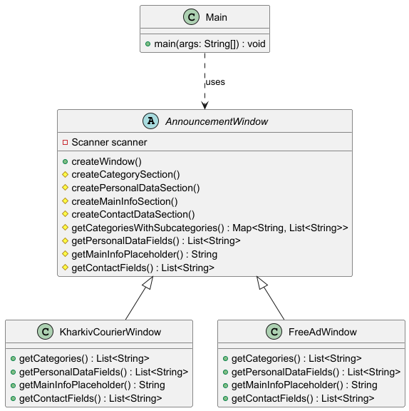

# Система Універсального Вікна для Введення Оголошень

Цей код демонструє реалізацію шаблонного вікна для введення оголошень у Java. Різні типи вікон оголошень наслідують загальну структуру, але мають власні унікальні конфігурації. Реалізація підтримує динамічні категорії, підкатегорії, а також налаштовувані секції, такі як рубрика, персональні дані, основна інформація та контактні дані.

## Можливості
1. **Шаблонний метод (Template Method Pattern)**:
    - Абстрактний клас `AnnouncementWindow` визначає послідовність кроків для створення вікна.
    - Дочірні класи (`KharkivCourierWindow`, `FreeAdWindow`) задають конкретні конфігурації для категорій, підкатегорій та полів.

2. **Підтримка категорій та підкатегорій**:
    - Головні категорії та додаткові підкатегорії динамічно обробляються в методі `createCategorySection`.

3. **Налаштовувані секції**:
    - Дочірні класи задають дані та поля для:
        - **Рубрика**
         - **Персональних даних**
         - **Основної інформації**
         - **Контактних даних**

4. **Інтерактивний консольний інтерфейс**:
    - Застосунок працює в терміналі/консолі й покроково веде користувача через введення даних. Якщо вийти за рамки концепції, то можна доробити додаток на swing, або перевести даний код у spring-boot додаток.

---

### UML Діаграма

Структура системи показана на зображенні нижче:

---

